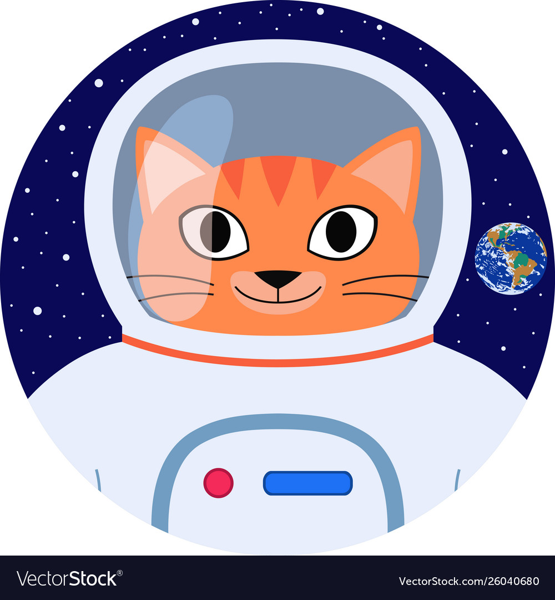
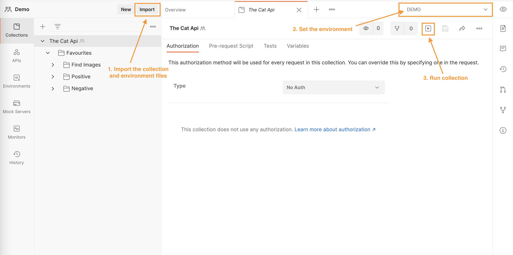

<!-- PROJECT LOGO -->
<br />
<p align="center">
  <a href="https://github.com/joyce-tong-dev/postman-api-tests">
    
  </a>

  <h3 align="center">Postman API Tests</h3>

  <p align="center">
    Testing The Cat API using Postman and Newman
    <br />
    <a href="https://www.postman.com/">Postman</a>
    ·
    <a href="https://github.com/postmanlabs/newman">Newman</a>
    .
    <a href="https://github.com/csplb/CatApi">The Cat API</a>
  </p>
</p>


## About The Project
This project uses the open-source [Cat API](http://thecatapi.com/) to demostrate how to write automated API tests using Postman and running the tests with Newman CLI.

Be sure to check out their [API documentation](https://docs.thecatapi.com/) for more details.


## Test Scope
For simplicity, this project focuses only on testing the `/favourites` function API.
* Save an images as Favourite
* Get all favourites
* Get a specific favourite
* Delete a favourite

We will check various aspects of the response for each request, including the body, status codes and headers. Some negative cases have also been added to cover the unhappy paths.

## How to install and run tests
You can run the tests either in Postman or in terminal using Newman.

To begin with, clone this repo to your local machine, or download the zip file from this repo and extract it. 

#### Postman
Running in Postman is easy. All you need to do is import the collection and environment files into Postman then run the collection. The screeshot below illustrates how to do so.


#### Newman
[Newman](https://www.npmjs.com/package/newman) is a CLI tool for running Postman collections. If you have Node.js and NPM installed already, you can easily install Newman using NPM.
```sh
$ npm install -g newman 
```

Otherwise you can install Newman globally by using Homebrew.
```sh
$ brew install newman 
```

Now you can use Newman `run` command to run the Postman collection. 
```sh
# assuming you are in the directory where the Postman files are 
$ newman run TheCatApi.postman_collection.json -e DEMO.postman_environment.json
```

## Postman collection
Test structure
```
TheCatApi                     
│
└───favourties
│   │
│   └───Find Images
│   │   │   Image Search
│   │
│   └───Positive
│   │   │   Save an image as a Favourite
│   │   │   Get your favourites
│   │   │   Get a specific favourite
│   │   │   Delete a favourite   
│   │    
│   └───Negative
│       │    
│       └───Invalid API Key
│       │   │   Save an image as a Favourite (-)
│       │   │   Get your favourites (-)
│       │   │   Get a specific favourite (-)
│       │   │   Delete a favourite (-)
│       │    
│       └───Duplicate Unique fields
│       │   │   Save duplicate image as a Favourite to same account
│       │   │   <more negative tests>
│
└───<other API tests>
    │   <test>
    │   <test>
```

The tests have been grouped and put in a specific order as shown above for the purpose of automating the `Favourties` workflows. Reordering the requests might cause the running tests to fail. 

Some cool Postman features are being used in this project to make the tests more resilient and maintainable:
* **Environment variables** - make sharing data (e.g. access token) between requests, tests and collections so much easier
* **Dynamic variables** - generate random dummy data for tests. Combining `$randomFirstName` and `$randomInt` creates an unique `SUB_ID` to be submitted to the Cat Api in each run 
* **Ajv schema validation** - a great built-in tool for validating JSON responses
* **`postman.setNextRequest()`** - a built-in function that allows you to specify which request to run next. In this project, it has been used to loop over the `Save an image as a Favourite` request for setting up sufficient data for subsequent tests and to repeat the `Get your favourites` request multiple times for testing pagination


The `Find Image` request is added to the collection merely for test setup. Currently, it will be executed once in order to fetch 5 random images which will then be used in all other `Favourites` tests. The tests can be run over and over again and they should work every time. 
